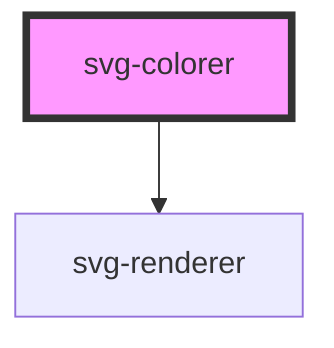

# svg-colorer

<!-- Auto Generated Below -->

## Properties

| Property         | Attribute       | Description | Type                   | Default     |
| ---------------- | --------------- | ----------- | ---------------------- | ----------- |
| `colors`         | --              |             | `Color[]`              | `undefined` |
| `images`         | --              |             | `Image[]`              | `undefined` |
| `selectorType`   | `selector-type` |             | `string`               | `"group"`   |
| `skippableTags`  | --              |             | `string[]`             | `undefined` |
| `svg`            | `svg`           |             | `string`               | `undefined` |
| `svgAssignDatas` | --              |             | `SVGAssignData<any>[]` | `undefined` |

## Dependencies

### Depends on

- [svg-renderer](../svg-renderer)

### Graph

----------------------------------------------

*Built with [StencilJS](https://stenciljs.com/)*
