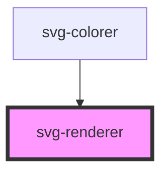

# svg-renderer

<!-- Auto Generated Below -->

## Properties

| Property         | Attribute       | Description | Type                   | Default     |
| ---------------- | --------------- | ----------- | ---------------------- | ----------- |
| `ownStyle`       | `own-style`     |             | `string`               | `""`        |
| `selectorType`   | `selector-type` |             | `string`               | `"group"`   |
| `skippableTags`  | --              |             | `string[]`             | `undefined` |
| `svg`            | `svg`           |             | `string`               | `undefined` |
| `svgAssignDatas` | --              |             | `SVGAssignData<any>[]` | `undefined` |

## Events

| Event             | Description | Type                              |
| ----------------- | ----------- | --------------------------------- |
| `elementClick`    |             | `CustomEvent<SVGElementWithData>` |
| `imageAddedToSvg` |             | `CustomEvent<any>`                |
| `rendered`        |             | `CustomEvent<SVGSVGElement>`      |
| `svgFilled`       |             | `CustomEvent<SVGSVGElement>`      |

## Methods

### `getData() => Promise<SVGAssignData<any>[]>`

#### Returns

Type: `Promise<SVGAssignData<any>[]>`

## Dependencies

### Used by

 - [svg-colorer](../svg-colorer)

### Graph

----------------------------------------------

*Built with [StencilJS](https://stenciljs.com/)*
